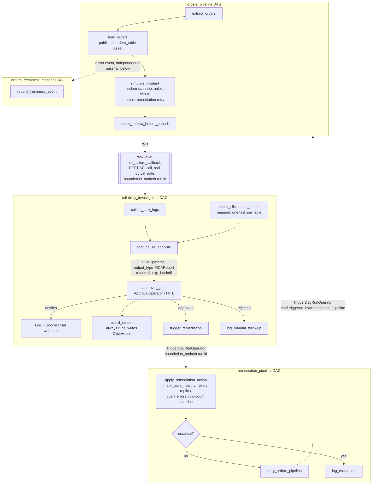

# Architecture

## Overview diagram

## Data flow

1. **`orders_pipeline`** extracts, loads (publishing the `orders_table` Asset), then `simulate_incident` picks one of four scenarios at random - healthy, replica lag, a query-error burst, or row-count drift - and seeds ClickHouse accordingly. The one exception: if this run's `conf.triggered_by == "remediation_pipeline"` (i.e. it's a post-remediation retry), `simulate_incident` skips re-rolling and just checks whatever state remediation left behind - re-randomizing here would overwrite a real fix with a fresh random failure and make remediation look broken.
2. `check_replica_before_publish` evaluates three independent conditions (replica health, recent query-error count, row-count delta) and fails if any trip.
3. On failure, a **task-level `on_failure_callback`** (set via `default_args`, not the DAG-level `on_failure_callback=` kwarg - see the note in `orders_pipeline_dag.py` on why) calls the Airflow REST API directly to create a `reliability_investigation` run, passing a real `logical_date` and a short `ts_nodash`-based run id in `conf`. Both details matter: a null `logical_date` disables `ts_nodash` and everything derived from it for that run *and every descendant DAG run triggered from it*, and chaining run ids onto the parent's (instead of a fresh bounded one) compounds every retry cycle into an ever-longer string that eventually exceeds the database's column limit.
4. Inside `reliability_investigation`: `collect_task_logs` summarizes the failure from `conf`; `check_clickhouse_health` is a **dynamically mapped task**, one per table; `build_evidence_bundle` combines both (materializing the mapped task's lazy XCom sequence into a real list first - leaving it lazy silently serializes to the string `"LazyXComSequence()"` instead of the actual data).
5. `root_cause_analysis` is an `LLMOperator` (Common AI Provider) with `output_type=RCAReport` - a Pydantic schema, not free-text JSON the code has to parse and hope is well-formed. It carries its own retry/backoff for transient upstream errors (e.g. a momentary 503 from the model provider).
6. `approval_gate` is an `ApprovalOperator` (HITL), notifying both a scheduler log line and, if configured, a real Google Chat webhook. `record_incident` runs independently of the approve/reject branch - writing to ClickHouse's `incidents` audit table regardless of the outcome, so rejected investigations are tracked too.
7. On approval, `trigger_remediation_conf` builds a plain-data conf dict (own task, since building it doesn't need direct DB access) and a `TriggerDagRunOperator` triggers `remediation_pipeline`.
8. **`remediation_pipeline`**'s `apply_remediation_action` calls `mark_table_healthy`, which resets *all three* simulated problem indicators for the table (replica status, query-error backlog, row-count snapshot) - not just the one the AI happened to diagnose. Remediation doesn't track which specific scenario was actually seeded, so a partial reset (replica only) left query-error and row-count-drift scenarios permanently unfixed, causing retries to fail on the same stale data indefinitely regardless of how many times they were approved. `escalate_to_oncall` skips remediation entirely - that path is explicitly "not something this DAG can automate."
9. Assuming a table was reset, `retry_orders_pipeline` (another `TriggerDagRunOperator`) re-triggers `orders_pipeline` with `conf={"triggered_by": "remediation_pipeline"}`, closing the loop back to step 1 - where `simulate_incident` recognizes that marker and checks rather than re-breaks.

Separately, **`orders_freshness_monitor`** has no schedule at all - it's triggered purely by the `orders_table` Asset event `load_orders` publishes, firing on every successful load regardless of whether that run's later health check passes or fails. It's parallel to, not part of, the failure-response loop above.

## Why Airflow is the right orchestrator here (not just an LLM agent loop)

- **Auditability**: every step - including the AI's reasoning and the human's decision - is a logged, versioned task instance, and separately written to a queryable ClickHouse `incidents` table, not a line in a chat transcript.
- **Retries & backoff** are Airflow's job (`root_cause_analysis`'s `retries=3` with exponential backoff), not something to reimplement in agent code.
- **Identity & access control**: named users via Simple Auth Manager (see `docker-compose.recording.yml`) mean HITL responses attribute to a real person, with a separate service account for the automated parts - the same human/service separation a real deployment would have.
- **Composability**: swapping the LLM provider, the warehouse, or the remediation logic is a config/operator change, not a rewrite of an agent framework.

## Key files

| File | Purpose |
|---|---|
| `dags/orders_pipeline_dag.py` | The pipeline; simulates a random scenario per run, publishes the `orders_table` Asset, triggers investigation on failure via the REST API |
| `dags/reliability_investigation_dag.py` | Evidence gathering → structured AI diagnosis → HITL approval → audit log → conditional remediation trigger |
| `dags/remediation_pipeline_dag.py` | Resets ClickHouse health state and retries the source pipeline, unless the action requires human escalation |
| `dags/orders_freshness_monitor_dag.py` | No cron schedule - triggered purely by the `orders_table` Asset event |
| `include/clickhouse_client.py` | ClickHouse helper: health checks, scenario seeding (`seed_random_incident`), comprehensive reset (`mark_table_healthy`), audit logging (`log_incident`) |
| `include/notifiers.py` | `LogOnCallNotifier` (always-on log line) and `GoogleChatNotifier` (real webhook push, no-ops if unconfigured) |
| `include/clickhouse_init/001_init.sql` | Seed schema, including the `incidents` audit table |
| `tests/test_dag_integrity.py` | DAG import errors, expected structure, failure-callback wiring, asset-vs-cron scheduling - run in CI |
| `.github/workflows/ci.yml` | Installs Airflow 3.1.5 + providers, runs the test suite on every push |
| `docker-compose.yml` | Default stack: anonymous-admin auth, zero login friction |
| `docker-compose.recording.yml` | Override: real named users (`hussain`, `reliability-bot`), for a demo/recording showing actual audit-trail identity |
